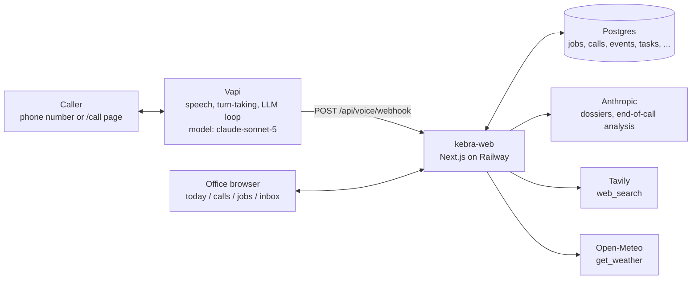
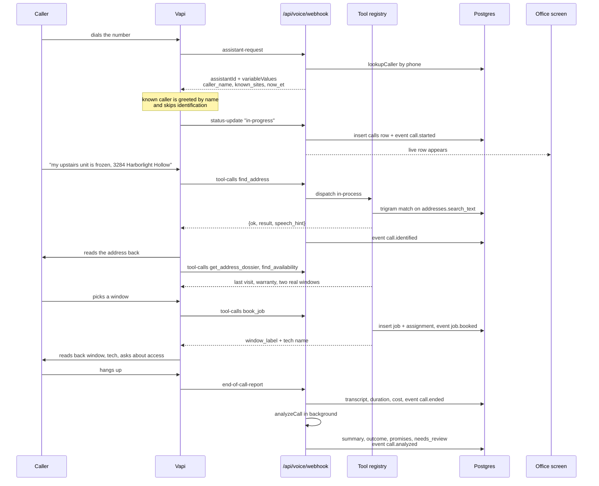
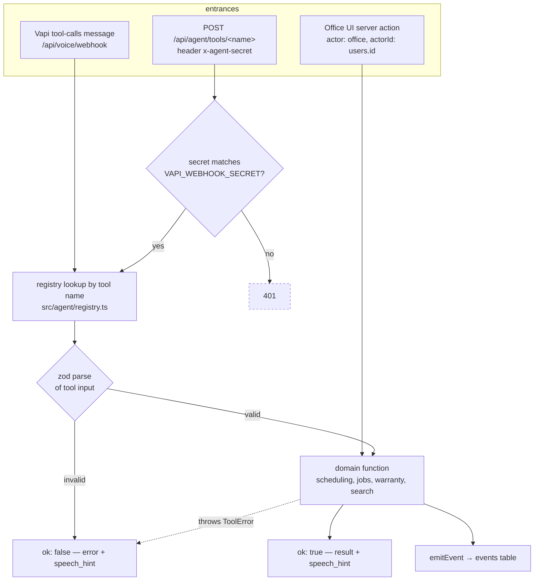
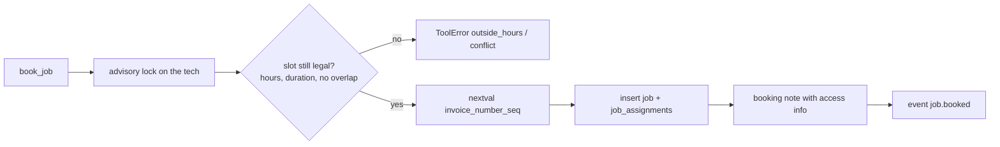
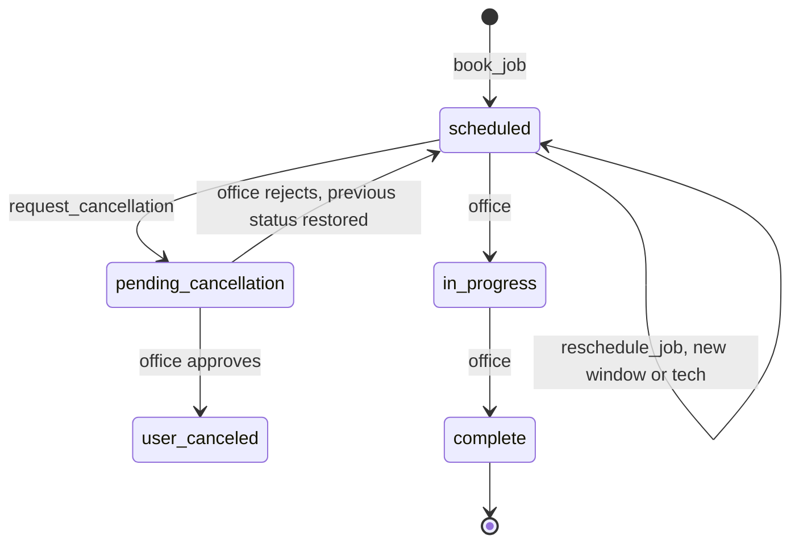
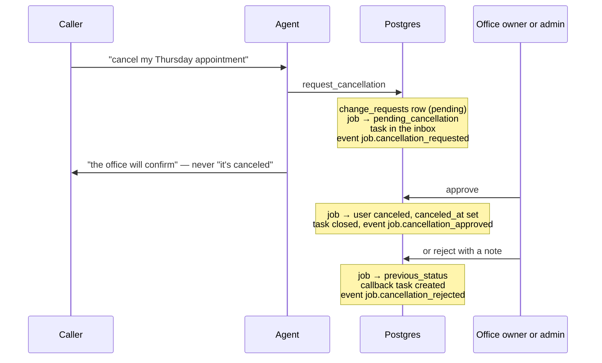
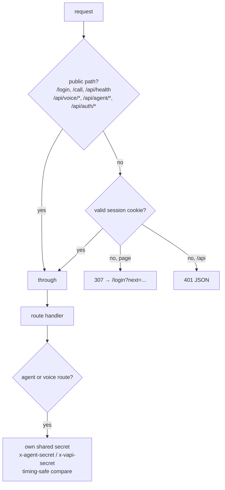
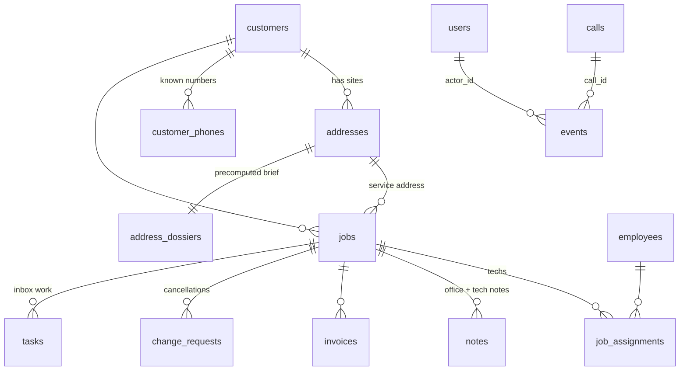
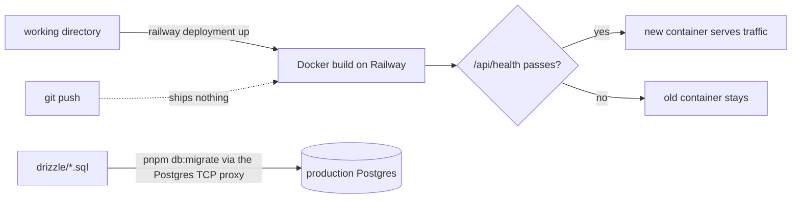

# Flow map

How a call becomes a booking, and how the office sees it — without reading the code.
Companion docs: [`TOOLS.md`](TOOLS.md) (every tool's input/output), [`EVENTS.md`](EVENTS.md)
(every event payload), [`UI-ARCHITECTURE.md`](UI-ARCHITECTURE.md) (component layers),
[`PLAN.md`](PLAN.md) (why it is built this way).

## 1. The pieces



Vapi owns the voice loop and the model. The app owns every fact: it never lets the model
invent scheduling, warranty or history — those come back as tool results with a
`speech_hint` the model can read aloud verbatim.

## 2. One inbound call, end to end



Transcript turns stream in on `transcript` messages, so the call page fills in while the
caller is still talking. `hang` and `transfer-update` cover the silent-call and
live-transfer paths.

## 3. The tool contract

Every tool is reachable two ways, and both land on the same registry entry — so anything
the agent can do, the office UI and a curl command can do too.



Rules that make the voice side safe: descriptions in the registry **are** the model's
prompt (`scripts/vapi-sync.ts` generates Vapi's tool definitions from them), every
response carries a one-sentence `speech_hint`, expected failures throw `ToolError` rather
than a bare `Error`, write tools take an `idempotency_key` so a repeated tool call returns
the original result, and no tool makes an LLM call inside the request — dossiers are
precomputed to keep p95 under the latency budget.

## 4. What a booking does to the data



The advisory lock plus the re-check inside the transaction is what stops two callers
booking the same tech in the same window. The invoice number comes from a Postgres
sequence, not `max()+1`, for the same reason.

## 5. Job status, and why cancellations are a request

The agent never cancels. It records a request; a human decides.





Approve and reject are owner/admin only. Rejection restores the exact status the job had
before, which is why `change_requests.previous_status` exists.

## 6. How the office screen stays live

```mermaid
sequenceDiagram
  participant T as Any write (agent or office)
  participant DB as Postgres
  participant S as /api/events/stream
  participant B as Board / activity strip

  T->>DB: domain write + emitEvent
  B->>S: GET ?since=<last id>
  loop every 1.5 s
    S->>DB: events with id > cursor
  end
  S-->>B: one JSON row per event
  B->>B: append to the activity strip
  B->>DB: refetch the day when a job.* event<br/>touches the visible date
  Note over S,B: heartbeat every 15 s;<br/>client reconnects with its last id
```

`events` is the single source for the live feed, a call's "actions taken" list, and the
audit trail — every mutation writes exactly one row through `emitEvent()`.

## 7. Who is allowed in



The webhook and tool routes are public to the *proxy* on purpose: they authenticate with a
shared secret inside the handler, never with a cookie.

## 8. Core tables



`service_types` and `business_hours` drive every availability search; `idempotency_keys`
de-duplicates repeated tool calls; `events` is written by everything.

## 9. Getting it to production

Two separate acts, neither implied by the other — see the README's *Deploy (Railway)*
section for the exact commands and the traps.


